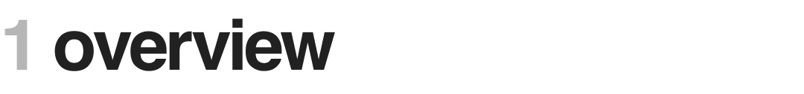
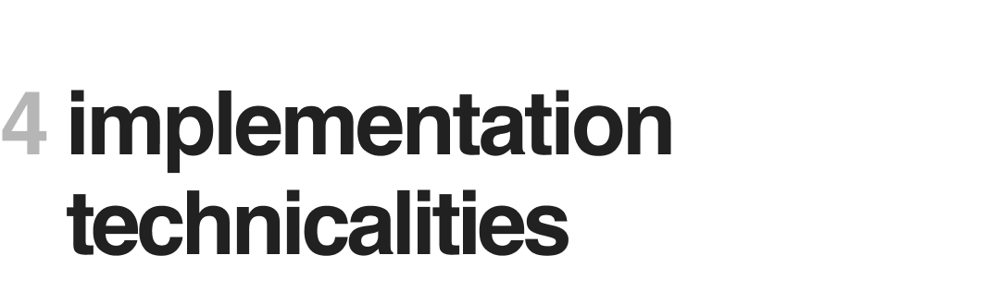

### 1.1 Brief description of game

Sokoban is a simple single-player puzzle game. The goal of the player is to be able to rearrange the crates so that they occupy all the designated locations on the map. The difficulty arises from the fact that some moves result in configurations that offer no reversals: some moves cannot be undone. And once the player is stuck in a bad configuration, restarting becomes the only option.

### 1.2 NP-hard problems

Sokoban is an NP-hard problem, meaning to say it is at least as hard as the problems in the NP complexity class. NP-hard problems are difficult to solve, but once solutions are found they are easy to verify. This is true of Sokoban: finding the solution may take a considerable amount of effort, but running through the solution can easily verify its validity.

In this section, we will gradually introduce the concepts underlying our approach and the different actions taken by the overall algorithm. Eventually, with domain language in place, we will be able to phrase our model succintly:

$$ \text{"} States \text{ evolve over time and can be assigned a } priority \text{ } score \text{ based on the state and its } map \text{."} $$

Likewise, the algorithm that operates over these concepts can be worded in about just as many words:

$$ \text{"}Viable \text{ } states \text{ are queued } by \text{ } priority \text{ until a } winning \text{ } state \text{ is found or the queue empties."} $$

The statements above will become clearer as we flesh out the meaning of the highlighted words within the context of the domain (Sokoban).

### 2.1 Defining the `SokoState` and `SokoMap` classes

> **A Brief Note on Nomeclature**
>
> Almost all classes created for this project are named with the prefix 'Soko'. This is only to ensure proper namespacing and to prevent collisions with common Java language constructs such as 'Map' or 'State'. However, the classes in the `utils/` folder do not follow this convention: they are not specific concepts tied to Sokoban and are only general helper classes.

In a game of Sokoban, some of its elements can move about while its other components stay fixed. Specifically, both the player and the crates can end up in different locations after moves have been played, but the goals and walls will never shift about. Thus, when performing a search across the Sokoban state space, it makes sense to enlist only those variable properties of the game within our "state objects": we define a "state object" as an entity that encapsulates the configuration of the movable game objects following a series of moves. 

In the case of our implementation, the `SokoState` class handles the duty of representing states. The elements of the game that remain unchanged can then be accessed by all these state objects through a shared reference to some other class. The `SokoMap` class encapsulates those non-variable properties of the game.

### 2.2 Defining the state priority score

Every state can be assigned a priority score that tells us how important it is. More important states are checked first when performing a search for a valid solution. There are a few things that can affect this evaluation, but we have decided to use the following parameters:

* `solution_length`

    Considers how many moves were needed to get to the current state. By default, our approach prefers states which require less moves. However, when inverting this heuristic, our algorithm actually finds solutions *in less time*, despite the solution length being unreasonably long. For certain maps, longer solutions are easier to find.

    Note that this heuristic corresponds directly to whether or not we're doing depth-first search (DFS) or breadth-first search (BFS). Prioritizing longer solutions is akin to performing DFS, while the opposite mirrors BFS.

* `good_crate_count`

    This just refers to the number of crates on goals for a given state. Our approach prefers states where more of the crates are already in their place, which makes sense, although it is important to note that some solutions require the momentary shifting of crates off of their goals to reach a final solution. 

* `centroid_distance`

    Centroid is just a fancy word for center of mass. In this case, we're comparing the average location of the crates to that of the goals (in other words, their centroids). States with the crates closer to the goals are preferred. 
    
    Computing centroids is much more efficient than manually comparing crates and goals on a pair-wise basis. Thus, we do not attempt to do the latter (the former is $\mathcal{O}(n)$ while the latter is $\mathcal{O}(n^2)$ ).

These three parameters are unified into a single value that represents the priority score of a given state. For added flexibility, coefficients were also defined which allows changing the "composition" of the priority score; that is, all three heuristics may not necessarily have equal weight, and the way the algorithm combines these heuristics can be modified.

### 2.3 Identifying dead-end states

Of course, evaluating the priority of a state only makes sense when the state we're scoring is *viable*. Some states are pointless to try and continue, such as when a crate gets stuck in some corner of the map. In general, the only times states become futile are when crates get stuck in some way. It is thus important to define a precise meaning for "stuck" in this case. Before we discuss the types of dead-end states, we first outline the two possible "stuck scenarios" a crate can be in.

* Permanently stuck crates

    This is easier to identify. Any crate that ends up in a corner between two walls is ***permanently stuck***. The logic for checking this also accounts for crates stuck in between more than two walls. Nevertheless, it is important to remember that when speaking of precisely two walls, only *adjacent* walls render permanently stuck crates. Walls on opposite sides can represent an opening of some sort and do not make a crate permanently stuck.

* Temporarily stuck crates

    The idea here is the same, except the scenario involves at least one other crate. A crate is ***temporarily stuck*** if it is obstructed on at least two adjacent sides by at least one crate and some walls. The examples below illustrate the scenario. It is imperative that the latter case (permanent stuckness) is checked before evaluating temporary stuckness, because otherwise something of the sort shown on the right may be evaluated as temporarily stuck.

    TODO INSERT A PICTURE OF CRATE SURROUNDED BY THREE WALLS AND A CRATE

In our approach, there are three criteria that identify dead-end states. But before

3.3 State serialization

    * helps avoid repeating states

3.4 State priorities

    3.4.1 Move count heuristic

    3.4.2 Centroid distance heuristic

    3.4.3 Good crates heuristic

   
    4.1 Testing approach
    
        * to automate the testing process, a mock of the original Java files were created
    
        * These were then used to check and play the solutions the bot would be given
    
        * it was easier to copy over the provided implementation of the game rather than to code one from scratch
    
        * also it looked more visually appealing to watch

    4.1 The Test class
    
        * helps isolate tests
    
        * makes sure to instantiate the involved objects each time, so no state is preserved

    4.2 The problem with having a Java test driver 
    
        * apparently, if a method isn't finished running within a thread, calling its .interrupt() method does nothing
    
        * the only way to kill those threads would be by exiting the main program thread
    
        * it is thus necessary to start each test as a separate process

    4.3 `tester.py`
    
        * this represents the test driver

    4.4 Map generation and map corpuses
    
        * explain valid file formats 
    
        * the map generation code was lifted from [here](https://github.com/xbandrade/sokoban-solver-generator/commits?author=xbandrade)

    2.1 Storing coordinates core effectively

        * using a single integer and sharing bits

    2.2 Separating state from constants

        * using a class for the state + another class for what doesn't change
   
    2.3 Rationale of overarching design patterns

        * using a state factory

        * having a separate crate entity to facilitate code expressiveness

* [x] stuck1.txt        (No Solution Found * true) 
* [x] stuck2.txt        (No Solution Found * true) 
* [x] base1.txt
* [x] base2.txt
* [x] base3.txt
* [x] base4.txt
* [x] twoboxes1.txt
* [x] twoboxes2.txt
* [x] twoboxes3.txt
* [x] threeboxes1.txt
* [x] threeboxes2.txt
* [x] threeboxes3.txt
* [x] fourboxes1.txt
* [x] fourboxes2.txt 
* [x] fourboxes3.txt
* [x] fiveboxes1.txt
* [x] fiveboxes2.txt
* [x] fiveboxes3.txt
* [x] original1.txt
* [ ] original2.txt     (TLE)
* [ ] original3.txt     (TLE)

This is actually pretty hard.

Note: if class instantiation becomes a significant overhead, we might refactor our code to use static methods instead (i.e., because OOP is very inefficient for these types of applications, we might resort to procedural idioms if our algo is still shit).

TODO

1. replace headers with images (figma)
2. complete the missing sections

So... refactor the StateFactory class... too much redundancy.