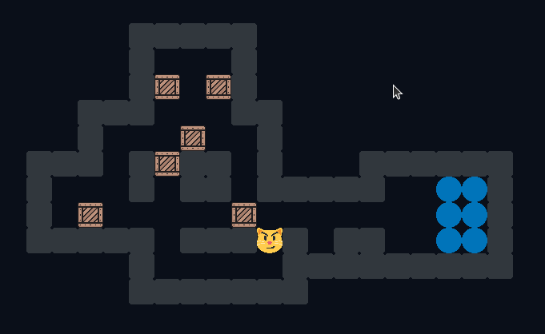
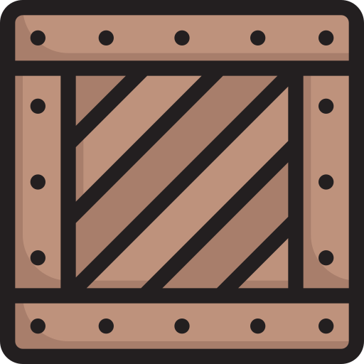
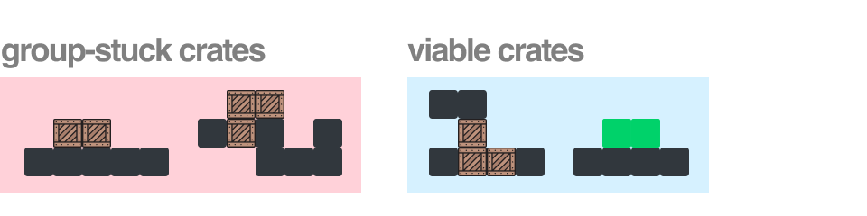

<center>

</center>

> **Legend**
>
> Here are the icons we will be using for the rest of the discussion for the sake of consistency.
> 
> <pre>
>  wall       goal       crate      player    crate on goal
>                           
> </pre> 
### 1.1 Brief description of Sokoban

Sokoban is a simple single-player puzzle game. The goal of the player is to be able to rearrange the crates so that they occupy all the designated locations on the map. The difficulty arises from the fact that some moves result in configurations that offer no reversals: some moves cannot be undone. And once the player is stuck in a bad configuration, restarting becomes the only option.

### 1.2 NP-hard problems

Sokoban is an NP-hard problem, meaning to say it is at least as hard as the problems in the NP complexity class. NP-hard problems are difficult to solve, but once solutions are found they are easy to verify. This is true of Sokoban: finding the solution may take a considerable amount of effort, but running through the solution can easily verify its validity.

### 1.3 Running the program

<!-- ! Explain how to run the program here -->


In this section, we will gradually introduce the concepts underlying our approach and the different actions taken by the overall algorithm. Eventually, with domain language in place, we will be able to phrase our model succintly:

$$ \text{"} States \text{ evolve over time and can be assigned a } priority \text{ } score \text{ based on the state and its } map \text{."} $$

Likewise, the algorithm that operates over these concepts can be worded in about just as many words:

$$ \text{"}Viable \text{ } states \text{ are queued } by \text{ } priority \text{ until a } winning \text{ } state \text{ is found or the queue empties."} $$

The statements above will become clearer as we flesh out the meaning of the highlighted words within the context of the domain (Sokoban).

### 2.1 Defining the `SokoState` and `SokoMap` classes

> **A Brief Note on Nomeclature**
>
> Almost all classes created for this project are named with the prefix 'Soko'. This is only to ensure proper namespacing and to prevent collisions with common Java language constructs such as 'Map' or 'State'. However, the classes in the `utils/` folder do not follow this convention: they are not specific concepts tied to Sokoban and are only general helper classes.

In a game of Sokoban, some of its elements can move about while its other components stay fixed. Specifically, both the player and the crates can end up in different locations after moves have been played, but the goals and walls will never shift about. Thus, when performing a search across the Sokoban state space, it makes sense to enlist only those variable properties of the game within our "state objects": we define a "state object" as an entity that encapsulates the configuration of the movable game objects following a series of moves. 

In the case of our implementation, the `SokoState` class handles the duty of representing states. The elements of the game that remain unchanged can then be accessed by all these state objects through a shared reference to some other class. The `SokoMap` class encapsulates those non-variable properties of the game.

### 2.2 Defining the state priority score

Every state can be assigned a priority score that tells us how important it is. More important states are checked first when performing a search for a valid solution. There are a few things that can affect this evaluation, but we have decided to use the following parameters:

> Heuristic for the priority score
>
> * `move_count`, `turn_move_count`, and `crate_move_count`
> * `good_crate_count`
> * `crate_goal_centroid_distance`

* `move_count`, `turn_move_count`, and `crate_move_count`

    These three values form one of the main heuristics and deal with the nature of the moves taken by the player so far. `move_count` simply refers to how many moves were needed to get to the current state. By default, our approach prefers states which require less moves. However, when inverting this heuristic, our algorithm actually finds solutions *in less time* for certain maps, despite the resulting solution being unreasonably long. Note that the way `move_count` is treated directly corresponds to whether or not we're doing depth-first search (DFS) or breadth-first search (BFS). Prioritizing longer solutions is akin to performing DFS, while the opposite mirrors BFS.
    
    The other two values, `turn_move_count` and `crate_move_count`, refer to the count of specific subsets of the moves performed by the player. The former counts how many moves represent a turn (a change in direction) of the player: the way the value is  set up prioritizes solutions that have less turns in order to make sure that the player does not wander aimlessly. The latter value counts how many moves involve pushing a crate. Such moves are preferred as they "get things done" (although it may have the unintended consequence of encouraging the bumping of crates off of their goals even after they've been placed there).

    All in all, these three values are summed up (with `crate_move_count` being negated first to ensure it contributes to reducing the cost of the state), although do note that the sum is weighted and the three are not treated equally. These weights may be considered [hyperparameters](https://en.wikipedia.org/wiki/Hyperparameter_(machine_learning)) of some sort.

* `good_crate_count`

    This just refers to the number of crates on goals for a given state. Our approach prefers states where more of the crates are already on top of goals, which makes sense, although it is important to note that some solutions require the momentary shifting of "good crates" to reach a final solution. 

* `crate_goal_centroid_distance`

    Centroid is just a fancy word for center of mass. In this case, we're comparing the average location of the crates to that of the goals (in other words, their centroids). States with the crates closer to the goals are preferred. 
    
    Computing centroids is much more efficient than manually comparing crates and goals on a pair-wise basis. Thus, we do not attempt to do the latter (the former is $\mathcal{O}(n)$ while the latter is $\mathcal{O}(n^2)$ ).

These three parameters are unified into a single value that represents the priority score of a given state. For added flexibility, coefficients were also defined which allows changing the "composition" of the priority score; that is, all three heuristics may not necessarily have equal weight, and the way the algorithm combines these heuristics can be modified. Again, these weights may be considered hyperparameters.

### 2.3 Identifying viable states

Of course, evaluating the priority of a state only makes sense when the state we're scoring is *viable*. Some states are pointless to try and continue, such as when a crate gets stuck in some corner of the map. In general, the only times states become futile are when crates get stuck in some way. We define precise meanings for "stuck" to help rigorize this idea.

> Types of stuck
>
> * Wall-stuck crates
> * Group-stuck crates

* **Wall-stuck crates**

    This is easier to identify. Any crate that ends up in a corner OR on a wall it cannot be pushed out of is ***wall-stuck***. Identifying crates that are wall-stuck can be done by preprocessing the map and identifying the cells that lead to these scenarios; however, it is important to note that cells with goals on them are exceptions to this rule, since crates can be stuck *on goals*. We elaborate our methods for preprocessing the map further in the succeeding section.

    


* **Group-stuck crates**

    Crates that are stuck because they are surrounded by other crates that are *also* stuck are called ***group-stuck*** crates. The check here performs a recursive call through uninspected crates: any adjacent crates are asked *recursively* whether or not they are stuck. If at least one of the recursive calls identifies a liberated crate, then the entire group is not permanently stuck; once the non-stuck crate is moved, it is possible for the other crates to become movable again. Otherwise, the entire group is actually stuck and the state is a dead-end.

    

### 2.4 Preprocessing the map

Preprocessing the map is a much more involved process. Although the idea of extracting metadata from the map may seem expensive at first, the optimization this entails is worth the implementation. A large number of states can be pruned from the search space by doing this.  

The preprocessing routine works by first marking all interior wall corners as unreachable spots on the map (this makes sense since crates that end up here can no longer be moved). The preprocessor then iterates through all possible pairs of corners that lie on the same `x` or `y` coordinates (but not both, since if both are equal then they are one and the same point). Cells along a line connecting such a pair of corners are also unreachable if that line is completely surrounded by an unbroken wall on at least one of its sides. The cases described in the figure below offer a clearer picture of what this should look like. The exact logic for checking this condition is a bit more involved (and hopefully the internal documentation suffices to outline the exact process), but the idea is no more complicated than that.

<!-- ! // ! insert figure here for the sitaution described above -->

### 2.5 Avoiding repeat states

When searching the space of possible solutions, it is very much possible for the bot to encounter the same state more than once through a number of different paths. However, the feasibility of any state does not depend on the actions that were taken to get there; in other words, a state can be evaluated independent of the moves before it. With that in mind, it is then possible (and highly necessary) for us be able to avoid states that have been visited. Visiting such states more than once can waste time at best and lead to infinite loops at worst.

The process by which repeat states are pruned is quite simple: every state is serialized into a single unique integer by taking into account only the locations of the player and the crates for that given state. After all, we do not need to check the locations of the walls and the goals since these are constant anyway (we've discussed this idea before). The locations of the movable components are combined by first representing each location with its own unique integer (this is implicitly done by the project code since this is how we've decided to handle locations) and then combining the different integers into one by means of a byte stream. Think of it as concatenating different strings by successively appending one after the other, except instead of character strings we're using byte strings (each integer is just a sequence of 4 bytes). Eventually, we end up with a long string of bytes. If we interpret this byte string as a Java `BigInteger`, then we've essentially just created a way to index our states without having to maintain a lot of overhead. Storing these indexes in a set optimizies lookup, and is the exact way we keep track of states in the code.   

### 2.6 The `SokoSolver` class

The `SokoSolver` represents the driver class that manages the entire high-level structure of the algorithm. It contains the iterator that processes the queue of states until a solution is found. It also utilizes the `SokoStateFactory` class which helps us queue the valid states that are reachable from the current state.

    <!-- ! // ! explain the actual algo here + pseudocode -->


> **Disclaimer**
> This part is more of an addendum to the actual algorithm. It is not necessary to browse this portion, but for those who get their kicks out of the nerdy bits, do read on.

### 3.1 Storing coordinates more effectively

It is a very common implementation to store coordinates as a pair of integers. However, this offers some considerable drawbacks. When iterating over the neighbors of a given location, the pair-wise notation of coordinates necessitates an imperative approach of the following sort:

```java

// Current coordinates
int currentXCoordinate;
int currentYCoordinate;

// Iterate over neighbors... big sad...
for(int i = 0; i < 4; i++) {
    switch(i) {

        // 0 - Neighbor on top
        case 0: doSomething(currentXCoordinate, currentYCoordinate - 1); break; 

        // 1 - Neighbor on right
        case 1: doSomething(currentXCoordinate + 1, currentYCoordinate); break;

        // 2 - Neighbor on bottom
        case 2: doSomething(currentXCoordinate, currentYCoordinate + 1); break;

        // 3 - Neighbor on left
        case 3: doSomething(currentXCoordinate - 1, currentYCoordinate); break;
    }
}

```

This is a bit too involved, and having to do this repeatedly clearly violates DRY principles and couples the code to the implementation of grid coordinates. However, by representing locations with a single integer, we can end up doing something like this instead:

```java

// Current location
int currentLocation;

// Iterate over neighbors... woah, wtf?
for(int direction : Location.DIRECTIONS) {
    doSomething(currentLocation + direction);
}

```

Perhaps I'm a little biased, but the brevity this entails is highly attractive. How exactly do we accomplish this? First off, the `x` and `y` coordinates can be combined into a single integer by sharing bits. An integer has $32$ bits or $4$ bytes... given that the grids we will be considering will surely have no more than $65535$ tiles on each side, $16$ bits or $2$ bytes (or perhaps considerably less) are more than enough to represent either coordinate. Essentially, we can let the `x` coordinate occupy the $16$ leftmost bits of an integer, while the `y` coordinate occupies the remaining bits. We call $16$ the `maskLength` of the location (since when retrieving coordinates, we use a bit mask of that given length to isolate the values from the location integer). 

With this in mind, we can then discuss how directions are implemented. To be able to write code with the declarative proclivities of the previous snippet, we define the following constants:

```java
// These are stored in the location class inside a map called DIRECTIONS
public static final int NORTH = -1;
public static final int SOUTH = 01;
public static final int EAST = (01 << maskLength);
public static final int WEST = (-1 << maskLength);
```

These simply represent different offset values associated with each coordinate. When adding `NORTH` to a location integer, the net effect is as if we modified `y` on its own by subtracting $1$ from it. The same can be said for the other constants: they add or subtract $1$ from either `x` or `y` to generate new locations adjacent to the current one along one of the cardinal axes. Voila!

Of course, if we want our code to use this effectively, we have to treat make sure all our functions receive and process locations as integers... that is, location integers are now some sort of "primitive".

### 3.2 Separating state from constants

Not all components of Sokoban are movable. In fact, some stay quite constant for the entire duration of the game. Goals and walls are static, and repeating information about the map across instances of a `State` class would incur a significant overhead (in terms of space complexity for the most part). A more performant implementation would abstract a `Map` class that holds all unchanging aspects of the game and provides an interface for querying facts about these components. 

In the case of our implementation, the `SokoState` class stores crate and player information and has responsibility for determining the statuses of the crates. To do this, it makes calls to one the methods of the `SokoMap` class and injects the required dependencies; this way, the statuses of the crates can be evaluated with respect to the walls and goals of the map. Such an implementation also allows a much more effective separation of concerns.
   
### 3.3 Rationale of overarching design patterns

There are some other minor design considerations that found themselves into the implementation of the project.

A factory was created for managing state creation. It felt a bit awkward having to include a number of different constructors for handling state creation logic within the `State` class itself, so a separate dedicated class was created entirely for this purpose. Initial states would be created by the `SokoStateFactory`, and so would adjacent states when traversing the state space.

A separate crate class was also necessitated by the algorithm. Including all crate-related logic within the `State` class would have considerably bloated the file. Crates have a lot of logic to check on their own, and maintaining information about the vacancy / occupation of their neighbors felt beyond the immediate responsibility of the `State` class. The `SokoCrate` class deals with stuckness checks, crate state management, and a number of other things to lift some burden off of the `SokoState` class. 


   
    4.1 Testing approach
    
        * to automate the testing process, a mock of the original Java files were created
    
        * These were then used to check and play the solutions the bot would be given
    
        * it was easier to copy over the provided implementation of the game rather than to code one from scratch
    
        * also it looked more visually appealing to watch

    4.2 The Test class
    
        * helps isolate tests
    
        * makes sure to instantiate the involved objects each time, so no state is preserved

    4.3 The problem with having a Java test driver 
    
        * apparently, if a method isn't finished running within a thread, calling its .interrupt() method does nothing
    
        * the only way to kill those threads would be by exiting the main program thread
    
        * it is thus necessary to start each test as a separate process

    4.4 `tester.py`
    
        * this represents the test driver

    4.5 Map generation and map corpuses
    
        * explain valid file formats 
    
        * the map generation code was lifted from [here](https://github.com/xbandrade/sokoban-solver-generator/commits?author=xbandrade)


    5.1 Hm

* [x] stuck1.txt        (No Solution Found * true) 
* [x] stuck2.txt        (No Solution Found * true) 
* [x] base1.txt
* [x] base2.txt
* [x] base3.txt
* [x] base4.txt
* [x] twoboxes1.txt
* [x] twoboxes2.txt
* [x] twoboxes3.txt
* [x] threeboxes1.txt
* [x] threeboxes2.txt
* [x] threeboxes3.txt
* [x] fourboxes1.txt
* [x] fourboxes2.txt 
* [x] fourboxes3.txt
* [x] fiveboxes1.txt
* [x] fiveboxes2.txt
* [x] fiveboxes3.txt
* [x] original1.txt
* [ ] original2.txt     (TLE)
* [ ] original3.txt     (TLE)


references:

https://stackoverflow.com/questions/1857244/what-are-the-differences-between-np-np-complete-and-np-hard
https://gamedev.stackexchange.com/questions/143064/most-efficient-implementation-for-a-sokoban-board
https://stackoverflow.com/questions/21069294/parse-the-javascript-returned-from-beautifulsoup
https://en.wikipedia.org/wiki/Hyperparameter_(machine_learning)